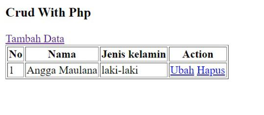

# CRUD PHP & MYSQL
 waht it's Crud ? (Create read Update dan delete ) dalam pemrograman ada 4 fungsi dasar dalam penyimpanan persisten. yaitu create untuk membuat data atau memasukan data ke database, read untuk melihat data atau get data, update yaitu untuk mengupdate data yang sudah ada di databse lalau kita update lagi ke database, dan delete yaitu cara menghapus data yang ada di database

## requirment/syarat
- [PHP > 7.0](https://php.net)
- [Mysql](https://www.mysql.com)
- [Webserver](https://www.nginx.com)
- [or Cross-platform XAMPP](https://www.apachefriends.org)

## instalasi

download script atau clone repo ini dengan cara
```
git clone https://github.com/Anggasayogo/UMB-2020-phpmysql.git
```
lalu buat nama databse
```
umb_2020
```
import file umb_2020.sql ke databse yang sudah dibuat
dan jalankan di :
```
localhost/namafolderscript
```

## happy success instalation
